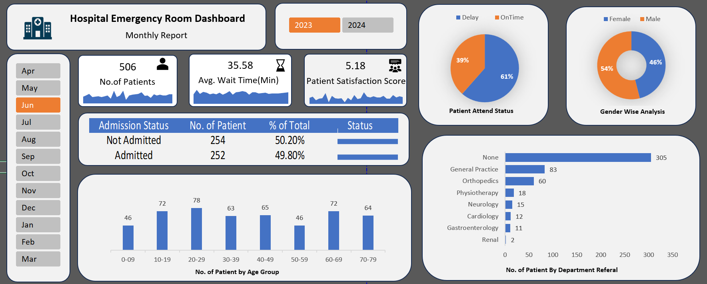

# 🏥 Hospital Emergency Room Analysis Dashboard (Excel)

An end-to-end interactive dashboard built in **Microsoft Excel**, using **Power Query**, **Power Pivot**, and **DAX**, to help hospital stakeholders monitor emergency room performance, patient flow, and service quality.

 

---

## 📌 Project Purpose

Hospitals need a fast, reliable way to monitor emergency room efficiency and patient experience. This project delivers a fully interactive Excel dashboard that helps stakeholders:

- Monitor patient volume, wait times, and satisfaction
- Track admission status and departmental referral trends
- Identify delays vs. on-time patient handling
- Analyze patient demographics (age & gender)
- Filter insights dynamically by **month** and **year**

---

## 🔧 Tools & Techniques Used

| Tool | Purpose |
|------|---------|
| **Power Query** | Data cleaning, transformation, and building a custom Calendar Table |
| **Power Pivot** | Data modeling and relationships |
| **DAX** | Calculated columns for Age Group and Patient Attend Status |
| **Excel Slicers** | Interactive filtering by Month & Year |
| **Excel Charts** | KPI cards, pie/donut charts, bar charts |

---

## 📊 KPIs Tracked

- **No. of Patients**
- **Average Wait Time (minutes)**
- **Patient Satisfaction Score**
- **Patient Attend Status** (On Time vs. Delay — seen within 30 minutes or not)
- **Admission Status** (Admitted vs. Not Admitted)

---

## 📈 Charts Included

1. **Patient Admission Status** – Admitted vs. Not Admitted, with % of total
2. **Patient Age Distribution** – Patients grouped into age bands
3. **Patient Attend Status (Timeliness)** – % of patients seen within 30 minutes vs. delayed
4. **Gender-Wise Analysis** – Patient count/share by gender
5. **Department Referral Analysis** – Which departments patients are referred to most often

---

## 🗓️ Calendar Table

A custom date table was built in Power Query to support time intelligence (Month/Year slicers):

```m
= List.Dates(#date(2023,01,01), 731, #duration(1,0,0,0))
```

This generates every date from **January 1, 2023** to **December 31, 2024** (731 days, covering the leap year 2024).

---

## 🧮 DAX Formulas

**Age Group (calculated column):**
```DAX
Age Group =
IF([Patient Age] >= 70, "70-79",
    IF([Patient Age] >= 60, "60-69",
        IF([Patient Age] >= 45, "45-59",
            IF([Patient Age] >= 30, "30-44",
                IF([Patient Age] >= 15, "15-29",
                    IF([Patient Age] >= 5, "05-14", "0-4"))))))
```

**Patient Attend Status (calculated column):**
```DAX
Patient Attend Status =
IF([Patient Waittime] < 30, "Within Time", "Delay")
```

---

## 🔍 Key Insights

- **506** total patients recorded, with an average wait time of **35.58 minutes**
- Patient satisfaction score: **5.18**
- **61%** of patients experienced delays vs. **39%** seen on time
- Near-even gender split: **54% Female, 46% Male**
- Admission split: **49.8% Admitted vs. 50.2% Not Admitted**
- Highest patient volume in the **20–29 age group**
- **General Practice** and **Orthopedics** are the top department referrals

---

## 📁 Repository Structure

```
├── README.md
├── Hospital_ER_Dashboard.xlsx        # Main Excel dashboard file
├── Project_Steps.pptx                # Project planning & documentation slides
└── assets/
    └── dashboard_preview.png         # Dashboard screenshot
```

---

## 🚀 How to Use

1. Download `Hospital_ER_Dashboard.xlsx`
2. Open in Excel (Power Query & Power Pivot enabled — Excel 2016+ or Microsoft 365 recommended)
3. Use the **Year** and **Month** slicers to filter the dashboard interactively
4. Explore KPIs, charts, and trends in real time

---

## 🧠 Skills Demonstrated

- Data cleaning & transformation with Power Query
- Data modeling with Power Pivot
- DAX for calculated columns
- Dashboard design & data storytelling
- Building custom date/calendar tables for time intelligence

---

## 📬 Connect

If you found this project useful or have feedback, feel free to connect or reach out!
